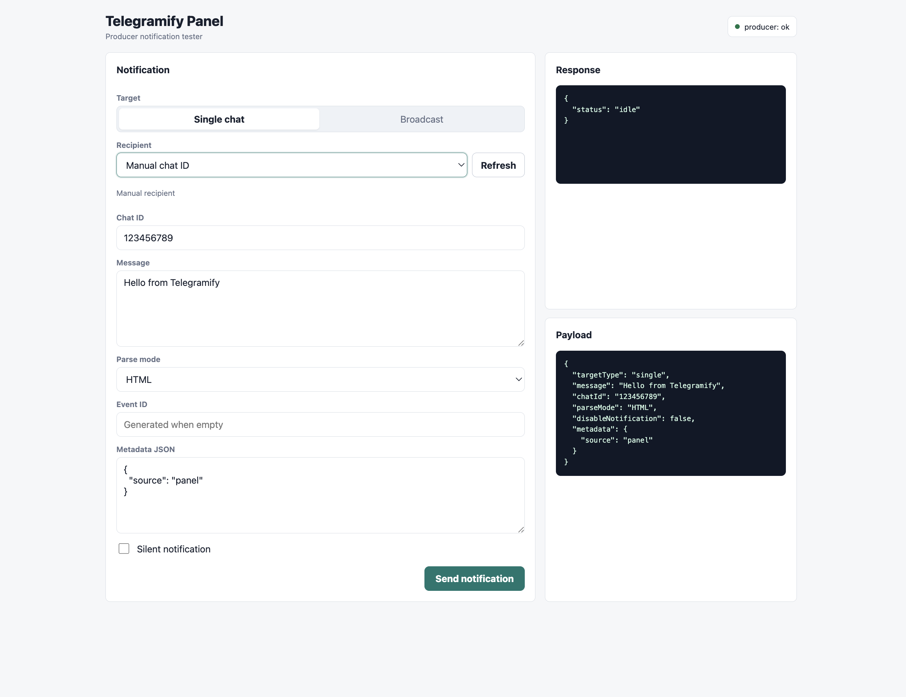
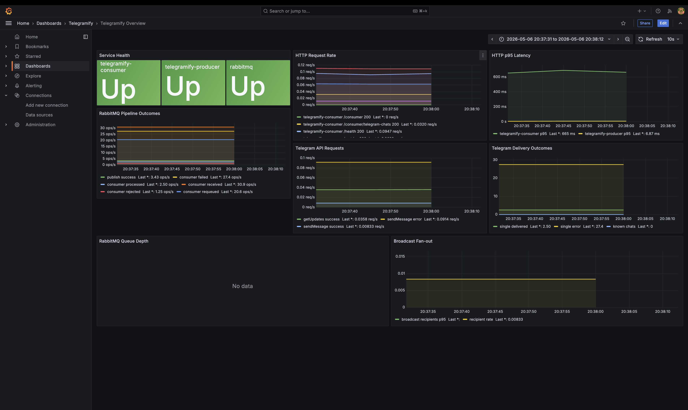
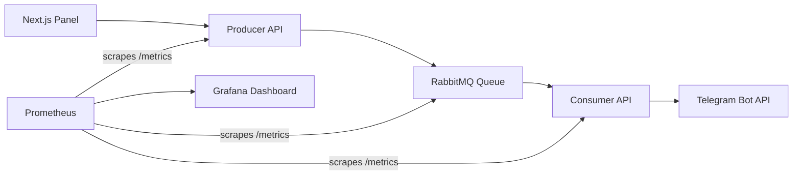

# Telegramify

Telegramify is a production-style Telegram notification system built as a small
microservice stack. It accepts notification requests through an API or panel,
publishes events to RabbitMQ, consumes them asynchronously, and delivers messages
through the Telegram Bot API.

The project is designed to demonstrate backend work that matters in production:
Nest.js APIs, asynchronous processing, Docker Compose orchestration, RabbitMQ,
Prometheus metrics, Grafana dashboards, alert rules, and 100% backend test
coverage.

## Highlights

| Area | What is implemented |
| --- | --- |
| API | Nest.js Producer and Consumer services with Swagger docs |
| Async pipeline | RabbitMQ queue, producer publish confirms, consumer retries and rejects |
| Telegram delivery | Single-chat and broadcast notification flows through Telegram Bot API |
| UI | Next.js panel for sending test notifications and loading known chats |
| Observability | Prometheus metrics, RabbitMQ metrics, Grafana dashboard, alert rules |
| Reliability | Health checks, retry counters, Docker Compose dependencies |
| Testing | Unit and integration tests with 100% backend coverage thresholds |

## Screenshots

| Panel | Observability |
| --- | --- |
|  |  |

## Architecture



## Quick Start

Run the complete system with one Docker Compose command:

```bash
TELEGRAM_BOT_TOKEN=your_bot_token docker compose up --build
```

If you only want to inspect the stack without real Telegram delivery, you can
start it without a token:

```bash
docker compose up --build
```

The Consumer will still run, but Telegram delivery and Telegram chat discovery
will report as unconfigured until `TELEGRAM_BOT_TOKEN` is provided.

## Runtime Configuration

Create a local `.env` file when you do not want to pass environment variables in
the shell:

```bash
cp .env.example .env
```

Then set the values locally:

| Variable | Required | Description |
| --- | --- | --- |
| `TELEGRAM_BOT_TOKEN` | For real delivery | Telegram Bot API token. Never commit this value. |
| `TELEGRAM_BROADCAST_CHAT_IDS` | Optional | Comma-separated chat ids to include in broadcast delivery. |

`.env` files are ignored by Git. The repository only contains safe examples and
placeholders.

## Service Map

Docker Compose starts all services below:

| Service | URL | Credentials | Purpose |
| --- | --- | --- | --- |
| Producer API | `http://localhost:3000` | none | Accepts events and publishes to RabbitMQ |
| Consumer API | `http://localhost:3002` | none | Reads notification events and talks to Telegram |
| Panel | `http://localhost:3001` | none | Browser UI for sending test notifications |
| RabbitMQ UI | `http://localhost:15672` | `guest` / `guest` | Queue inspection and management |
| RabbitMQ metrics | `http://localhost:15692/metrics` | none | Prometheus scrape target |
| Prometheus | `http://localhost:9090` | none | Metrics storage and alert rules |
| Grafana | `http://localhost:3003` | `admin` / `admin` | Telegramify dashboard |

## API Overview

### Producer

| Method | Path | Description |
| --- | --- | --- |
| `GET` | `/health` | Producer health check |
| `GET` | `/metrics` | Prometheus metrics |
| `GET` | `/producer` | Producer metadata |
| `POST` | `/producer/events` | Publish a generic event to RabbitMQ |
| `POST` | `/producer/telegram-notifications` | Publish a Telegram notification event |
| `GET` | `/api/docs` | Swagger UI |

### Consumer

| Method | Path | Description |
| --- | --- | --- |
| `GET` | `/health` | Consumer health check |
| `GET` | `/metrics` | Prometheus metrics |
| `GET` | `/consumer` | Consumer metadata |
| `GET` | `/consumer/telegram-chats` | Known Telegram chats from Bot API updates |
| `GET` | `/api/docs` | Swagger UI |

## Sending Notifications

Use the panel at `http://localhost:3001`, or call the Producer API directly.

Single-chat notification:

```json
{
  "targetType": "single",
  "chatId": "123456789",
  "message": "Hello from Telegramify",
  "parseMode": "HTML",
  "disableNotification": false,
  "metadata": {
    "source": "manual-test"
  }
}
```

Broadcast notification:

```json
{
  "targetType": "broadcast",
  "message": "System maintenance starts at 21:00",
  "metadata": {
    "source": "admin-panel"
  }
}
```

Both requests publish the event type `telegram.notification.requested`. The
Consumer reads the event envelope from RabbitMQ and sends `payload.message.text`
to either one chat or all resolved broadcast recipients.

## Telegram Chat Discovery

Telegram bots cannot list every possible chat globally. A chat becomes known to
the bot only after a user or group interacts with it.

To test real delivery:

1. Open the bot in Telegram and send `/start`.
2. Read updates without committing the token:

```bash
curl "https://api.telegram.org/bot$TELEGRAM_BOT_TOKEN/getUpdates"
```

3. Use the returned `chat.id` in the panel or API.

Broadcast delivery uses the union of:

| Source | Description |
| --- | --- |
| `TELEGRAM_BROADCAST_CHAT_IDS` | Explicit local comma-separated chat ids |
| `getUpdates` known chats | Chats that have already interacted with the bot |

Phone numbers are only available when a user explicitly shares a contact with
the bot.

## Observability

Prometheus scrapes the Producer, Consumer, and RabbitMQ. Telegram Bot API is an
external service, so it is not scraped directly; the Consumer records Telegram
request outcomes and exposes those counters through its own `/metrics` endpoint.
Grafana is provisioned automatically with the `Telegramify Overview` dashboard
and the Prometheus data source.

| Metric group | Examples shown in Grafana |
| --- | --- |
| Service health | Producer, Consumer, RabbitMQ target availability |
| HTTP | Request rate, status codes, p95 latency |
| RabbitMQ publish | Success/error count, publish duration, retry attempts |
| RabbitMQ consume | Received, processed, failed, requeued, rejected messages |
| Telegram API | `sendMessage` and `getUpdates` success/error/missing-token rates |
| Delivery | Single and broadcast delivery outcomes |
| Broadcast | Recipient count and fan-out rate |
| Queue depth | Ready and unacked messages for `telegramify.notifications` |

Alert rules live in `observability/prometheus/alert-rules.yml`.

| Alert | Trigger |
| --- | --- |
| `TelegramifyServiceDown` | Producer, Consumer, or RabbitMQ target is down |
| `TelegramifyHighHttpErrorRate` | More than 5% HTTP 5xx responses over 5 minutes |
| `TelegramifyHighHttpLatency` | p95 HTTP latency above 1 second |
| `TelegramifyRabbitmqPublishFailures` | Producer publish failures |
| `TelegramifyConsumerRejectedMessages` | Consumer rejected messages after retries |
| `TelegramifyTelegramApiFailures` | Telegram API errors or missing-token events |

## Local Development

You can run each service outside Docker while keeping RabbitMQ in Docker.

Start RabbitMQ:

```bash
docker compose up -d rabbitmq
```

Run Producer:

```bash
cd producer
npm install
HOST=127.0.0.1 PORT=3000 npm run start:dev
```

Run Consumer:

```bash
cd consumer
npm install
HOST=127.0.0.1 PORT=3002 TELEGRAM_BOT_TOKEN=your_bot_token npm run start:dev
```

Run Panel:

```bash
cd panel
npm install
npm run dev
```

## Testing

Producer and Consumer enforce 100% coverage thresholds for statements,
branches, functions, and lines.

| Command | Purpose |
| --- | --- |
| `cd producer && npm test -- --coverage --runInBand` | Producer unit coverage |
| `cd consumer && npm test -- --coverage --runInBand` | Consumer unit coverage |
| `cd producer && npm run test:e2e` | Producer integration tests |
| `cd consumer && npm run test:e2e` | Consumer integration tests |
| `cd producer && npm run build` | Producer production build |
| `cd consumer && npm run build` | Consumer production build |
| `cd panel && npm run typecheck` | Panel TypeScript check |
| `docker compose config --quiet` | Compose configuration validation |

## Project Structure

```text
.
|-- producer/        # Nest.js API that publishes events to RabbitMQ
|-- consumer/        # Nest.js worker/API that consumes events and sends Telegram messages
|-- panel/           # Next.js notification test panel
|-- observability/   # Prometheus and Grafana provisioning
|-- docs/            # Screenshots and project documentation assets
`-- docker-compose.yml
```

## What This Project Demonstrates

| Requirement area | Where it appears |
| --- | --- |
| Nest.js API design | Producer and Consumer controllers, DTO validation, Swagger |
| Message brokers | RabbitMQ publish/consume flow with retries and rejects |
| External API integration | Telegram Bot API client and error handling |
| Docker Compose | Full local stack with health checks and service dependencies |
| Metrics and dashboards | Prometheus, RabbitMQ Prometheus plugin, Grafana provisioning |
| Testing discipline | Unit and integration tests with enforced 100% backend coverage |
